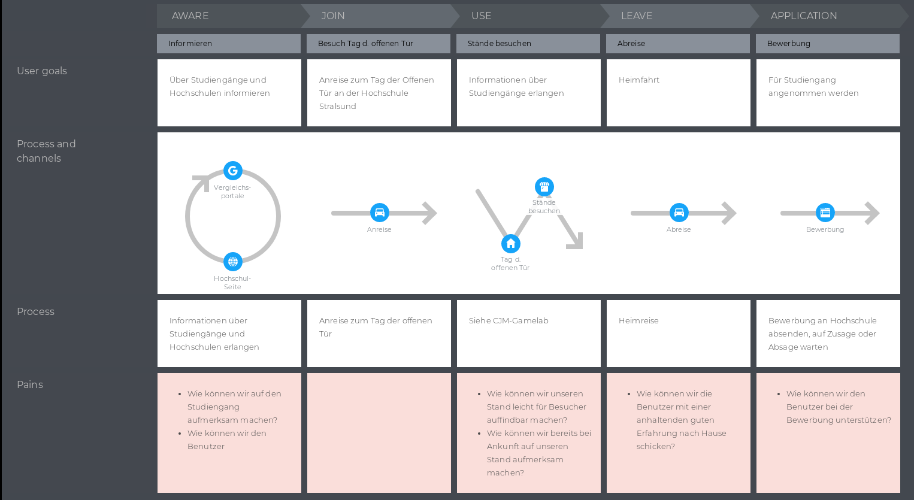
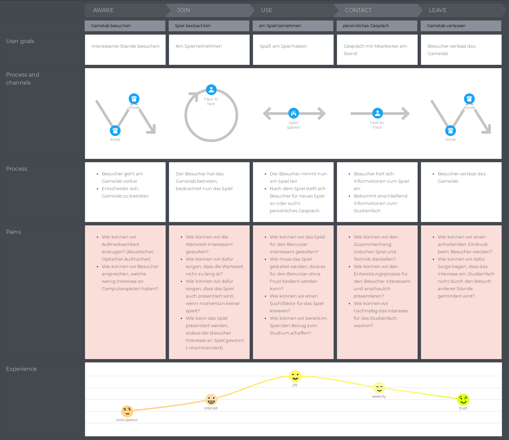

::: block
*Software-Engineering II SS2020* {style=background:red;width:600px;color:white}
::: 

REVIEW SPRINT 1

Gensch, Marschall, Meier

---

## Übersicht

1. Quellenanalyse
    * Primärquellen
    * Sekundärquellen
2. Personae
3. Customer Journey Maps
4. Wie können wir...
5. Stakeholder
6. Vorgehen

---

# Primärquellen

--

## Prof. Wedemann

- Auftragvermittler
- Auftrag: Interaktives Spiel für Besucher des Campus-Tag / Tag der Technik 
- Auftraggeber: Fakultät für Elektrotechnik und Informatik der Hochschule Stralsund
- [ \[P1\] Folien der Lehrveranstaltung](https://ilias.hochschule-stralsund.de/ilias/ilias.php?ref_id=130049&cmd=view&cmdClass=ilrepositorygui&cmdNode=u4&baseClass=ilrepositorygui)

--

## Prof. Wedemann

- Anforderungen
  - 1-4 Spieler 
  - 3-5 Minuten Spielzeit
  - Toucheingabe über Folie / Monitor
  - Keine mobilen Endgeräte
  - Hohes interaktives Level *"Action"*
  - Interesse am Studiengang SMIB wecken

 

<small>Quelle: [\[P1\]](https://ilias.hochschule-stralsund.de/ilias/ilias.php?ref_id=130049&cmd=view&cmdClass=ilrepositorygui&cmdNode=u4&baseClass=ilrepositorygui), persönliches Gespräch</small>

--

## Tilo Zülske
- Technischer Mitarbeiter / Betreuer
- Interview
  - Zielgruppe identifizieren
  - Anforderungen definieren
- [\[P2\] Gesprächsprotokoll](https://nextcloud.msl-services.de/s/RoeWcGxiHDPkQC9) widerspricht teilweise Protokollen anderer Anwesender  
  -> Audioaufnahme

--

## Tilo Zülske

- Anforderungen
  - Toucheingabe
  - 1-8 Spieler in ein bis zwei Instanzen
  - Kurze abgeschlossene Spieleinheiten
  - Eventuell mit Ton
  - Eventuell Pause-Funktion
  - ...

 
 

<small>Quelle: [\[P2\]](https://nextcloud.msl-services.de/s/RoeWcGxiHDPkQC9)</small>

--

## Tilo Zülske

- Anforderungen
  - ...
  - Selbsterklärende Spielregeln
  - Geringer Betreuungsaufwand
  - Geringer Wartungsaufwand
  - Schneller Aufbau
  - Bei Veranstaltung Aufmerksamkeitserzeugend

 

<small>Quelle: [\[P2\]](https://nextcloud.msl-services.de/s/RoeWcGxiHDPkQC9)</small>

--

## Tilo Zülske

- Anwesende
  - Schüler / Azubi
  - Eltern
  - Lehrer
  - Hochschulangehörige
  - Kinder (der Hochschuleangehörigen)
- Zielgruppe: 
  - Schüler der Mittel- und Oberstufen
  - Azubi in technischen Bereichen

<small>Quelle: [\[P2\]](https://nextcloud.msl-services.de/s/RoeWcGxiHDPkQC9)</small>

--

## Eigene Erfahrung 

- Besuch der Veranstaltung
- Einstellungsgespräche möglicher Studierender (Gensch)
- Wissen über den Studiengang SMIB
- Nutzen für Fragestellung und Bewertung von Aussagen

---

# Sekundärquellen

--

## Sekundärquellen

<small style="text-align: left">

[\[S1\] Nach-dem-Abitur.de: *Umfrage 2016*, abg. 17.4.20](
https://www.nach-dem-abitur.de/umfragen-nach-dem-abitur-ergebnisse)

[\[S2\] Deutsche Bildung: *SchulhofBarometer2017*, abg. 17.4.20](
https://www.deutsche-bildung.de/fileadmin/Dokumente/SchulhofBarometer_2017.pdf)

[\[S3\] Statista: *Geschlechterverteilung im Informatik Studium 2020*, abg. 20.4.20](
https://de.statista.com/statistik/daten/studie/732331/umfrage/studierende-im-fach-informatik-in-deutschland-nach-geschlecht/)

[\[S4\] Statista: *Altersverteilung Gamer in Deutschland 2020*, abg. 19.4.20](
https://de.statista.com/statistik/daten/studie/198202/umfrage/altersverteilung-von-gamern-in-deutschland-in-absoluten-zahlen/)

[\[S5\] Statista: *Bevölkerung - Zahl der Einwohner in Deutschland nach Altersgruppen 2019*, abg. 19.4.20](
https://de.statista.com/statistik/daten/studie/1365/umfrage/bevoelkerung-deutschlands-nach-altersgruppen/)

[\[S6\] Statista: *Anzahl der Schüler/innen an allgemeinbildenden und beruflichen Schulen in D 2020*, abg. 20.4.20](
https://de.statista.com/statistik/daten/studie/981823/umfrage/anzahl-der-schueler-an-allgemeinbildenden-schulen/)

[\[S7\] SIHK Luenburg: *IHKN-Auszubildenden-Zufriedenheitsumfrage 2018*, abg. 20.4.20](
https://www.ihk-lueneburg.de/blueprint/servlet/resource/blob/4200664/df2f6a820184b248711670c1bb2ad959/ergebnisse-der-azubi-zufriedenheitsumfrage-2018-data.pdf)

[\[S8\] Statistisches Amt MV: *Entwicklung an den Hochschulen des Landes MecklenburgVorpommern 2019*](https://cdn.discordapp.com/attachments/697379084698910814/701988856328880128/SchulhofBarometer_20171.pdf)
</small>

--

## Kriterien berufliche Entscheidung

<canvas data-chart="bar">
<!-- 
{
 "data": {
  "labels": ["Interessen / Fähigkeiten","Gehalt","Berufschancen","Selbstverwirklichung"],
  "datasets": [
   {
    "data":[35,25,20,14],
    "label":"Kriterien berufliche Entscheidung [S1]","backgroundColor":"rgba(38,139,210,.8)"
   }
  ]
 }, 
"options": { 
    "responsive": "true" ,
    "scales": {
      "yAxes": [{
        "ticks": {
          "beginAtZero": "true"
        },
        "scaleLabel": {
          "display": "false",
          "labelString": "% der befragten Schüler"
        }
      }]
    }
  }
}
-->
</canvas>

--

## Nach dem Abitur

<canvas data-chart="bar">
<!-- 
{
 "data": {
  "labels": ["Ungewiss", "Ausland", "Studium", "Jobben", "Ausbildung"],
  "datasets": [
   {
    "data":[35,25,15,10,10],
    "label":"Plan nach dem Abitur [S1]","backgroundColor":"rgba(38,139,210,.8)"
   }
  ]
 }, 
 "options": { 
    "responsive": "true" ,
    "scales": {
      "yAxes": [{
        "ticks": {
          "beginAtZero": "true"
        },
        "scaleLabel": {
          "display": "false",
          "labelString": "% der befragten Schüler"
        }
      }]
    }
  }
}
-->
</canvas>

--

## Gründe für Unentschlossenheit

<canvas data-chart="bar">
<!-- 
{
 "data": {
  "labels": ["Entscheidung fällt schwer", "Nicht informiert", "Überfordert", "Mangelnder Überblick"],
  "datasets": [
   {
    "data":[57,24,23,20],
    "label":"Schwierigkeiten bei Zukunftsentscheidung [S2]","backgroundColor":"rgba(38,139,210,.8)"
   }
  ]
 }, 
"options": { 
    "responsive": "true" ,
    "scales": {
      "yAxes": [{
        "ticks": {
          "beginAtZero": "true"
        },
        "scaleLabel": {
          "display": "false",
          "labelString": "% der befragten Schüler der Stufen 9-12"
        }
      }]
    }
  }
}
-->
</canvas>

--

## Weitere Ergebnisse

- etwa 69% der Jugendlichen zwischen 10-19 spielen Computerspiele [S4][S5]
- etwa 6300 Studienanfänger an der Host, davon 3100 weiblich [S8]
- bundesweit weniger als 20% der Studierenden des Fachs Informatik weiblich [S3]

---

# Personae

--

## Personae 

- Anforderung: 
  - Inspirierend
  - Evtl. Extrema
  - Basierend auf Quellenanalyse

- Zielgruppe: 
  - Mögliche zukünftige Studienanfänger 

--

### Jannis Lehmann

<small style="text-align:left">

Quelle: [M1]

Alter: 15 [P2]

Geschlecht: männlich

Wohnort: Stralsund

Beschäftigung: Schüler [P2]

Background:
 
&nbsp;&nbsp;&nbsp; - Von Eltern mitgebracht, hätten gerne das er studiert [P2]   
&nbsp;&nbsp;&nbsp;  - Feste Freundesgruppe [S1]

Vorkenntnisse:
 
&nbsp;&nbsp;&nbsp; - Informatik in der Schule

</small> 

--

### Jannis Lehman

<small style="text-align:left">

Quelle: [M1]

Ziele:
 
  
&nbsp;&nbsp;&nbsp; - Realschule -> Ausbildung [S1]
   
  &nbsp;&nbsp;&nbsp;  - Direkt Geld verdienen [S1,S.20][S2]

 

Frustration:
 
  

  &nbsp;&nbsp;&nbsp; - Motivationslosigkeit gegenüber Theorie [S1,S.20]  
  &nbsp;&nbsp;&nbsp; - Undursichtige Übersicht über Möglichkeiten [S1,S.20]  
  &nbsp;&nbsp;&nbsp; - Praktischer Anteil nicht direkt ersichtlich [S1,S.20]  
  &nbsp;&nbsp;&nbsp; - Arbeitsplatzsicherheit und mögliches Gehalt [S7]  
  &nbsp;&nbsp;&nbsp; - Geldsorgen [S7]

Motivationen:
 
  

  &nbsp;&nbsp;&nbsp; - Spielt gerne Computerspiele [S4][S5][S6]  
  &nbsp;&nbsp;&nbsp; - Eltern beide Ausbildung gemacht [S1]   
  &nbsp;&nbsp;&nbsp; - (Pflichtpraktikum) Durch Praktikum motiviert zum Arbeiten [S7]

</small> 

--

### Julie Busch

<small style="text-align:left">

Quelle: [M1]

Alter: 16 [P2]

Geschlecht: weiblich

Wohnort: Berlin

Beschäftigung: Schülerin / Gymnasium [P2]

Background:
 
&nbsp;&nbsp;&nbsp; - Gute Schülerin   
&nbsp;&nbsp;&nbsp;  - Soziales Engagement, Betreuung Kindersportgruppe

Vorkenntnisse:
 
&nbsp;&nbsp;&nbsp; - Leistungskurs Mathematik [S2]

</small> 

--

### Julie Busch

<small style="text-align:left">

Quelle: [M1]

Ziele:
 
  
&nbsp;&nbsp;&nbsp; - guter, sicherer Job   
  &nbsp;&nbsp;&nbsp;  - <i>"etwas bewegen"</i> [S2]

Frustration:
 
  

  &nbsp;&nbsp;&nbsp; - Welcher Studiengang? [S1][S2]  
  &nbsp;&nbsp;&nbsp; - Druck, über die Zukunft zu entscheiden[S1]  
  &nbsp;&nbsp;&nbsp; - Fehlende Übersicht über Möglichkeiten[S1]

Motivationen:
 
  

  &nbsp;&nbsp;&nbsp; - Will studieren [S1][S2]  
  &nbsp;&nbsp;&nbsp; - Soziales Engagement, Betreueung Sportgruppe [S1][S2]   
  &nbsp;&nbsp;&nbsp; - Kreativität im Beruf 

</small> 

--

### Robert Krause

<small style="text-align:left">

Quelle: [M1]

Alter: 17 [P2]

Geschlecht: männlich

Wohnort: Greifswald

Beschäftigung: Schüler / Gymnasium [P2]

Background:
 
&nbsp;&nbsp;&nbsp; - Nach der Schule Auslandsjahr [S2]   
&nbsp;&nbsp;&nbsp;  - danach studieren[S1][S2]

Vorkenntnisse:
 
&nbsp;&nbsp;&nbsp; - Fortgeschrittener Umgang mit digitalen Medien  
&nbsp;&nbsp;&nbsp;  - Sehr gebildeter akademischer Haushalt

</small> 

--

### Robert Krause

<small style="text-align:left">

Quelle: [M1]

Ziele:
 
  
&nbsp;&nbsp;&nbsp; - Akademischer Abschluss
   
  &nbsp;&nbsp;&nbsp;  - Hoher Lebensstandard

Frustration:
 
  

  &nbsp;&nbsp;&nbsp; - Viel Theorie -> Angst zu scheitern / Eltern zu enttäuschen [S1]
  
  &nbsp;&nbsp;&nbsp; - Verlust des Freundeskreises [S1]

Motivationen:
 
  

  &nbsp;&nbsp;&nbsp; - Erwartungen der Eltern erfüllen [P2][S1]  
  &nbsp;&nbsp;&nbsp; - Ansehen durch akademischen Abschluss

</small> 

---

# Customer Journey Map

--

  

--

  

---

# Wie können wir?

--

## Wie können wir...

<section style="text-align:left">
  
... Aufmerksamkeit auf den Stand lenken?

  
... das Spiel für Beobachter interessant gestalten?

  
... mittels des Spiels für das Studienfach werben?

  
... dem Besucher eine nachhaltig positive Erfahrung ermöglichen?

  
... das Spiel ausreichend schnell erschließbar gestalten?

  
... Die Fakultät überzeugen ausreichende Mittel zur Verfügung zu stellen?

</section>

---

# Stakeholder

--

<small>

**Rolle** | **Name**
-------------|---------------
Auftragvermittler | Prof. Wedemann
Technischer Mitarbeiter / Anwender | Bertin
^^ | Tilo Zülske
Entwickler | Hannes Hoffman
^^ | Lisa Smith
^^ | Leon Gudow
Geldgeber | Fakultätsrat
Zielgruppe | Mika Wegener

</small>

---

# Vorgehen während des Sprints

--

## Verwendete Tools

- Kanban-Board (Trello)
- Google Docs
- Cloud Storage
- Kalender
- Polls
- Konferenzsoftware
- UXpressia.com

--

## Ablauf

- Regelmäßige Teambesprechungen
- Vorstellung der Ergebnisse seit letztem Treffen
- Gemeinsamer Review der Ergebnisse
- Erneute Aufgabenverteilung 
- Update Kanban-Board

---

# Quellen

--

<small style="text-align: left">

[\[P1\] Prof. Wedemann: *Gespräch und Folien der Lehrveranstaltung*](https://ilias.hochschule-stralsund.de/ilias/ilias.php?ref_id=130049&cmd=view&cmdClass=ilrepositorygui&cmdNode=u4&baseClass=ilrepositorygui)

[\[P2\] Tilo Zülske: *Gesprächsprotokoll Interview April 2020*](
https://nextcloud.msl-services.de/s/RoeWcGxiHDPkQC9)

[\[S1\] Nach-dem-Abitur.de: *Umfrage 2016*, abg. 17.4.20](
https://www.nach-dem-abitur.de/umfragen-nach-dem-abitur-ergebnisse)

[\[S2\] Deutsche Bildung: *SchulhofBarometer2017*, abg. 17.4.20](
https://www.deutsche-bildung.de/fileadmin/Dokumente/SchulhofBarometer_2017.pdf)

[\[S3\] Statista: *Geschlechterverteilung im Informatik Studium 2020*, abg. 20.4.20](
https://de.statista.com/statistik/daten/studie/732331/umfrage/studierende-im-fach-informatik-in-deutschland-nach-geschlecht/)

[\[S4\] Statista: *Altersverteilung Gamer in Deutschland 2020*, abg. 19.4.20](
https://de.statista.com/statistik/daten/studie/198202/umfrage/altersverteilung-von-gamern-in-deutschland-in-absoluten-zahlen/)

[\[S5\] Statista: *Bevölkerung - Zahl der Einwohner in Deutschland nach Altersgruppen 2019*, abg. 19.4.20](
https://de.statista.com/statistik/daten/studie/1365/umfrage/bevoelkerung-deutschlands-nach-altersgruppen/)

[\[S6\] Statista: *Anzahl der Schüler/innen an allgemeinbildenden und beruflichen Schulen in D 2020*, abg. 20.4.20](
https://de.statista.com/statistik/daten/studie/981823/umfrage/anzahl-der-schueler-an-allgemeinbildenden-schulen/)

[\[S7\] SIHK Luenburg: *IHKN-Auszubildenden-Zufriedenheitsumfrage 2018*, abg. 20.4.20](
https://www.ihk-lueneburg.de/blueprint/servlet/resource/blob/4200664/df2f6a820184b248711670c1bb2ad959/ergebnisse-der-azubi-zufriedenheitsumfrage-2018-data.pdf)

[\[S8\] Statistisches Amt MV: *Entwicklung an den Hochschulen des Landes MecklenburgVorpommern 2019*](https://cdn.discordapp.com/attachments/697379084698910814/701988856328880128/SchulhofBarometer_20171.pdf)

[\[M1\] Unsplash Inc](https://unsplash.com/)

</small>

